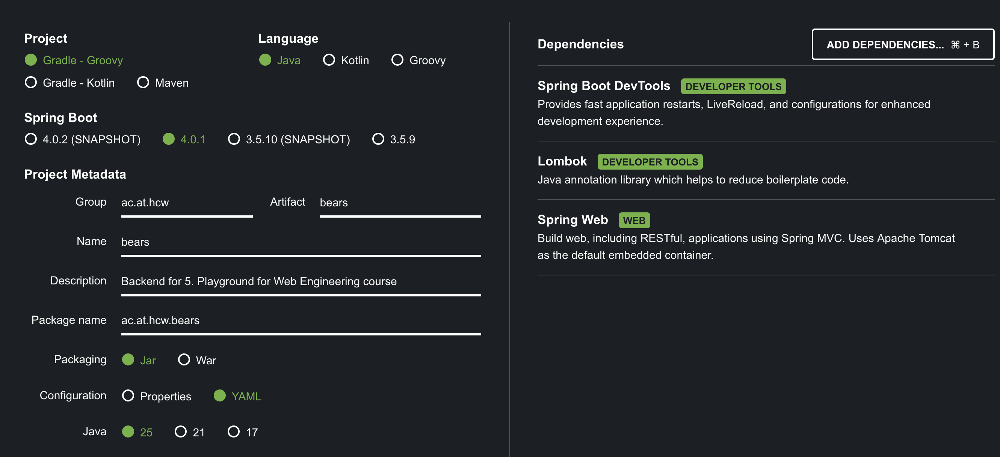

# 1. Initialize Spring
"Setup a backend framework of your choice."

1. moved all the files that belongs to the frontend part to `fronted` directory
2. created an empty `backend` directory 
3. used the Spring initializr to kick off a Spring project
  - https://start.spring.io/
  - 
4. The Spring application is ready to run!

# 2. Create an API
"Create an API your frontend will be connected to. Your backend should request the bear data from presented Wikipedia API and serve it to your frontend."

- implemented an API with fetching logic similar to what was already implemented in frontend

# 3. Configure CORS
"Configure CORS to only allow requests from your frontend."

## References
- [Enabling Cross Origin Requests for a RESTful Web Service](https://spring.io/guides/gs/rest-service-cors#_enabling_cors)

# 4. Replace the frontend Wikipedia API calls with calls to your backend
"Replace the frontend Wikipedia API calls with calls to your backend - the functionality of your frontend should work as before!"

- removed the fetching logic from frontend and replace it with a simple call to the backend

# Create multi-stage Dockerfiles for your applications
"Create multi-stage Dockerfiles for your applications (depending on your frameworks):
- The frontend Dockerfile should: 1. run the app in a development environment 2. build the app 3. serve build artifacts over Nginx
- The backend Dockerfile should: 1. run the app in a development environment 2. build the app if there is a build step in your framework (optional) 3. serve the app
"

## How to run?

### Frontend
- development
  - build 
    - `docker build --target development -t bears-frontend:dev .`
  - run
    - `docker run -p 5173:5173 -v $(pwd):/app -v /app/node_modules bears-frontend:dev`
- production
  - build
    - `docker build --target production -t bears-frontend:prod .`
  - run
    - `docker run -p 5173:80 bears-frontend:prod`

#### Reference
- [How to Deploy a Vite React App using Nginx server?](https://dev-mus.medium.com/how-to-deploy-a-vite-react-app-using-nginx-server-d7190a29d8cd)
- [nginx - Beginner’s Guide](https://nginx.org/en/docs/beginners_guide.html)
- [docker hub - node image](https://hub.docker.com/_/node)
- [gzip compression](https://developer.mozilla.org/en-US/docs/Glossary/gzip_compression)

### Backend
- development
  - build
    - `docker build --target development -t bears-backend:dev .`
  - run
    - `docker run -p 8080:8080 -v $(pwd)/src:/app/src bears-backend:dev`
- production
  - build
    - `docker build --target production -t bears-backend:prod .`
  - run
    - `docker run -p 8080:8080 bears-backend:prod`

#### Reference
- [Spring Boot with Docker](https://spring.io/guides/gs/spring-boot-docker)
- [Eclipse Temurin Docker Images](https://hub.docker.com/_/eclipse-temurin)
- [Gradle Docker Images](https://hub.docker.com/_/gradle)

# docker-compose
"Create two docker-compose files to orchestrate you applications in development and production mode:
- Define ports and dependencies
- Define corresponding stage (development, production)
- Use environment variables if possible
"

- development
  - `docker-compose -f docker-compose.yml up --build`
- production Mode
`docker-compose -f docker-compose.prod.yml up --build`

Introduced env variables:
- `VITE_API_URL`: Backend API URL (default: http://localhost:8080)
- `CORS_ALLOWED_ORIGINS`: Allowed CORS origins for backend (default: http://localhost:5173)

## Reference
- [Compose file reference](https://docs.docker.com/reference/compose-file/version-and-name/)